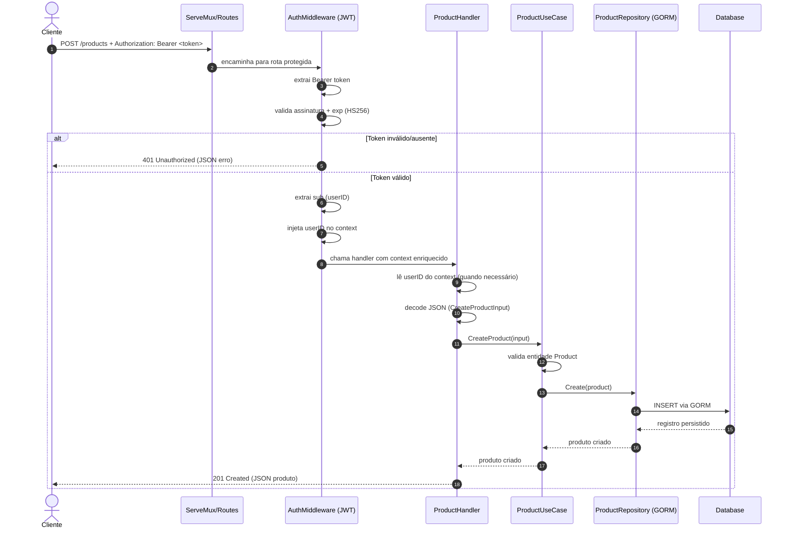

# GO API — README (Documentação Viva)

Última atualização: **2025-12-26** (fuso **Brasília / America/Sao_Paulo**)  
Versão da documentação: **V6**  
Código validado contra: `<CODE_HASH_V6>` *(substituir pelo output de `git rev-parse --short HEAD`)*  
Validação: `go test ./...` — **A PREENCHER** *(executar e preencher nesta data)*  

Módulo Go: `github.com/luishenriqs/GoProject/GoExperts_Phase_3/APIs`

Este README descreve o **estado atual** do código e serve como referência **acadêmica** e **operacional**.
O **rastro histórico** de mudanças (o que foi adicionado/alterado e quando) deve ser registrado em `CHANGELOG.md`.
---

## 1) Escopo e princípios fixos

### Escopo funcional
- API HTTP com **duas entidades**:
  - `User`
  - `Product`
- **Autenticação JWT (HS256)**.
- CRUD completo para `Product` e endpoints “me” para `User`.

### Princípios de implementação (acadêmicos)
- **Go puro (`net/http`)**: roteamento com **`http.ServeMux`**; bibliotecas auxiliares são aceitas apenas para funcionalidades transversais (JWT, Logging, Swagger), desde que permaneçam compatíveis com `http.Handler` e não substituam o roteamento.
- Rotas com **`http.ServeMux`**.
- Persistência via **GORM**.
- **SQLite** para dev/test e E2E.
- **MySQL** para runtime quando configurado.
- Testes em camadas e `go test ./...` sempre verde.

---

## 2) Arquitetura por camadas

A API é organizada em camadas com responsabilidades bem separadas.

### 2.1 Domain — `internal/entity`
**Responsabilidade:** regras de negócio puras e validações (sem HTTP e sem banco).

- `User`
  - normalização de email (`trim` + `lower`)
  - validação de email
  - hash de senha (bcrypt) e verificação (`CheckPassword`)
- `Product`
  - validações de `id`, `name` e `price`
  - `CreatedAt` gerado na criação

### 2.2 Application — `internal/usecase`
**Responsabilidade:** orquestrar casos de uso e chamar repositórios.

- `UserUseCase`
  - `RegisterUser`
  - `Login`
  - `GetMe`
  - `UpdateMe`
  - `DeleteMe`
- `ProductUseCase`
  - `CreateProduct`
  - `ListProducts` (paginação + ordenação)
  - `GetProduct`
  - `UpdateProduct`
  - `DeleteProduct`

### 2.3 Infra (Persistência) — `infra/database`
**Responsabilidade:** implementar contratos de repositório com GORM (CRUD real).

- `User` repository (GORM)
- `Product` repository (GORM)

### 2.4 Web (HTTP) — `api/handlers` e `api/middleware`
**Responsabilidade:** camada de transporte.

- Handlers:
  - decodificam JSON
  - chamam usecases
  - mapeiam erros → status HTTP
  - retornam JSON
- Middleware JWT:
  - lê `Authorization: Bearer <token>`
  - valida token
  - extrai `sub` (userID)
  - injeta userID no `context`

### 2.5 Rotas — `api/routes.go`
**Responsabilidade:** registrar endpoints no `ServeMux` e aplicar middleware nas rotas protegidas.

### 2.6 Composition Root — `cmd/server/main.go`
**Responsabilidade:** montar a aplicação em runtime (config → DB → repos → usecases → handlers → mux → server).

---
### 2.7 Diagrama de sequência — requisição protegida (ex: `POST /products`)

✅ Ajuste V5: diagrama com sintaxe Mermaid válida e texto alinhado ao estado atual (usecases **sem `context.Context`** na assinatura).


O diagrama abaixo mostra **como os dados e as responsabilidades fluem** através das camadas quando o cliente chama uma rota protegida.  
Pontos de atenção acadêmicos:
- **O middleware é a “porta de entrada”**: sem JWT válido, a requisição **não alcança** handler/usecase/repositório.
- O handler atua como **adaptador HTTP**: traduz request/response em DTOs e status.
- O usecase concentra a **orquestração do caso de uso**, sem detalhes de HTTP ou GORM. **Neste projeto**, os métodos do usecase recebem apenas os **inputs** (sem `context.Context`).
- O repositório concentra a **persistência**, isolando o domínio do banco.



### 2.8 Injeção de Dependências (Wiring) e o papel do `main.go` como *Composite Root*

Em Go, é comum evitar *frameworks de DI* e fazer a composição manual.  
Neste projeto, `cmd/server/main.go` é o **Composite Root** (ou “raiz de composição”): o único lugar onde os componentes são **instanciados e conectados**.

#### O que isso significa na prática
- As camadas “de cima” (**handlers**) **dependem** de camadas “de baixo” (**usecases**, **repos**, **DB**).
- Para manter as responsabilidades separadas, o *wiring* acontece **de baixo para cima**:

1. **DB** (infra)  
   Abre conexão com base em `DB_DRIVER` (sqlite/mysql) e executa `AutoMigrate`.
2. **Repositories** (infra/database)  
   Recebem a conexão GORM e expõem operações de persistência.
3. **UseCases** (internal/usecase)  
   Recebem interfaces de repositório (contratos) e orquestram casos de uso.
4. **Handlers** (api/handlers)  
   Recebem usecases e fazem adaptação HTTP (JSON/status).
5. **Mux/Routes** (api/routes.go)  
   Registra paths e aplica middleware nas rotas protegidas.
6. **Server** (`http.ListenAndServe`)  
   Sobe a API com o mux pronto.

#### Por que isso é didaticamente importante
- Você consegue **apontar exatamente onde cada dependência nasce**.
- Testes ficam mais simples: você pode trocar implementações (ex: repo real → fake) sem alterar o domínio.
- Isso evidencia a **Inversão de Controle**: quem “manda” não é a entidade ou o usecase, mas o *wiring* no `main.go`.

---


## 3) Fluxo end-to-end de uma requisição

### 3.1 Fluxo “público” (sem token)
1. Cliente chama `POST /users` para criar um usuário.
2. Cliente chama `POST /login` para obter `access_token`.

### 3.2 Fluxo “protegido” (com token)
1. Cliente chama endpoint protegido enviando:
   - `Authorization: Bearer <access_token>`
2. Middleware JWT:
   - valida token
   - lê claim `sub`
   - coloca `userID` no `context`
3. Handler:
   - recupera `userID` do contexto
   - chama usecase
   - responde com JSON / status correto

---

## 4) Contrato HTTP (endpoints)

> Observação importante: `http.ServeMux` não roteia por método.  
> Nos paths que aceitam múltiplos verbos, existe “dispatch por método” (`switch r.Method`) nos wrappers/handlers agregadores.

### 4.1 Rotas públicas

#### `POST /users` — Criar usuário
Body (JSON):
```json
{
  "name": "John Doe",
  "email": "john@example.com",
  "password": "123456"
}
```

Respostas:
- `201 Created` (retorna user sem senha)
- `400 Bad Request` (JSON inválido / validações do domínio)
- `500 Internal Server Error`

#### `POST /login` — Autenticar e gerar token
Body (JSON):
```json
{
  "email": "john@example.com",
  "password": "123456"
}
```

Respostas:
- `200 OK`:
```json
{
  "access_token": "<jwt>"
}
```
- `400 Bad Request` (JSON inválido)
- `401 Unauthorized` (credenciais inválidas)
- `500 Internal Server Error`

JWT:
- algoritmo: **HS256**
- claims:
  - `sub`: `<userID>`
  - `exp`: `now + JWT_EXPIRESIN` (segundos)

---

### 4.2 Rotas protegidas (JWT obrigatório)

#### `GET /users/me` — Dados do usuário autenticado
- `200 OK` (user sem senha)
- `401 Unauthorized`
- `404 Not Found` (user não encontrado)
- `500 Internal Server Error`

#### `PUT /users/me` — Atualizar usuário autenticado
Body (JSON) com campos opcionais:
```json
{
  "name": "New Name",
  "password": "newpass"
}
```

- `200 OK` (user atualizado sem senha)
- `400 Bad Request`
- `401 Unauthorized`
- `404 Not Found`
- `500 Internal Server Error`

#### `DELETE /users/me` — Remover conta do usuário autenticado
- `204 No Content`
- `401 Unauthorized`
- `404 Not Found`
- `500 Internal Server Error`

---

#### `POST /products` — Criar produto
Body (JSON):
```json
{
  "name": "Keyboard",
  "price": 100.5
}
```

- `201 Created` (produto criado)
- `400 Bad Request` (validações do domínio)
- `401 Unauthorized`
- `500 Internal Server Error`

#### `GET /products` — Listar produtos (paginado)
Query params:
- `page` (default defensivo)
- `limit` (default defensivo)
- `sort` = `asc|desc` (ordenado por `created_at`)

Resposta:
- `200 OK`:
```json
{
  "items": [ ... ],
  "total": 123
}
```

- `401 Unauthorized`
- `500 Internal Server Error`

#### `GET /products/{id}` — Buscar produto por id
- `200 OK`
- `400 Bad Request` (id inválido)
- `401 Unauthorized`
- `404 Not Found`
- `500 Internal Server Error`

#### `PUT /products/{id}` — Atualizar produto
Body (JSON) com campos opcionais:
```json
{
  "name": "New Keyboard",
  "price": 150
}
```

- `200 OK`
- `400 Bad Request`
- `401 Unauthorized`
- `404 Not Found`
- `500 Internal Server Error`

#### `DELETE /products/{id}` — Remover produto
- `204 No Content`
- `400 Bad Request` (id inválido)
- `401 Unauthorized`
- `404 Not Found`
- `500 Internal Server Error`

---

## 5) Autenticação JWT (detalhes e decisões)

### 5.1 Biblioteca e versão
A API foi padronizada para:
- `github.com/go-chi/jwtauth/v5`

Misturar `jwtauth` (sem `/v5`) com `jwtauth/v5` gera erro de build por **incompatibilidade de tipos**.

### 5.2 Extração do `sub`
Na versão adotada, o token é lido via:
- `token.Get("sub")`

Não foi adotado acesso direto a `.Claims` / `.Valid` para evitar incompatibilidades.

### 5.3 Contexto
O middleware injeta `userID` no `context` usando uma chave **privada do package** (padrão de encapsulamento).

Consequência prática para testes:
- não “forjar” `context.WithValue` em testes com chaves próprias
- sempre testar rotas protegidas **passando pelo middleware real** e um token real

---

## 6) Persistência (GORM) e bancos

### 6.1 SQLite
- Usado em testes unitários/integração e no E2E.
- Usado também como opção prática de desenvolvimento local.

### 6.2 MySQL
- Suportado para runtime.
- Infra preparada via `docker-compose.yaml`.
- Seleção por `DB_DRIVER=mysql` no `.env`.

---

## 7) Estrutura do repositório: **mapa factual de pacotes** + como obter a árvore exata

Nesta seção, o conteúdo é escrito para ser **100% aderente** sem inferir nomes/quantidade de arquivos internos.  
O objetivo aqui é registrar **os pacotes (paths) e responsabilidades** — e orientar como extrair do repositório a **lista exata** de arquivos quando você quiser auditar o estado atual.

### 7.1 Como obter a árvore exata de arquivos (snapshot verificável)
Na raiz do módulo `APIs`, rode:

```bash
# árvore completa (recomendado)
tree -a

# alternativa sem tree
find . -maxdepth 4 -type f | sort
```

> Por definição, **a lista exata de arquivos** é sempre a árvore do repositório (snapshot acima).

### 7.2 Mapa de pacotes e responsabilidades (o que cada pasta representa)

- `configs/`  
  Carregamento de configuração (Viper/.env) e inicialização do `TokenAuth` (jwtauth/v5), além de parâmetros de DB/porta/JWT.

- `cmd/server/`  
  **Composite Root**: cria DB → repos → usecases → handlers → registra rotas no mux → inicia o servidor HTTP.

- `internal/dto/`  
  DTOs de entrada/saída da camada HTTP (tipos usados para decode/encode JSON).  
  **Nota:** os DTOs podem estar em um ou mais arquivos; o que importa é o pacote e seu propósito.

- `internal/entity/`  
  Entidades do domínio e validações (ex.: normalização/validação de email, hash/verificação de senha, validações de produto).

- `internal/usecase/`  
  Casos de uso: orquestração do fluxo de negócio usando **interfaces** de repositório.  
  **Importante (estado atual):** os métodos do usecase recebem apenas inputs (sem `context.Context`).

- `infra/database/`  
  Implementações de repositório usando GORM + interfaces (contratos) consumidas pela camada de usecase.

- `api/`  
  Camada web/HTTP: rotas, handlers e middleware.
  - `api/routes.go`: registra endpoints no `http.ServeMux` e aplica middleware nas rotas protegidas.
  - `api/handlers/`: handlers HTTP (decode/encode JSON, status codes, chamadas para usecases).
  - `api/middleware/`: middleware JWT e funções auxiliares para extrair userID do `context`.

- `pkg/entity/`  
  Tipos utilitários compartilháveis (ex.: `ID` com UUID + parse/generate).

- `test/e2e_test.go` (pasta `APIs/test/`)  
  Teste E2E/integrado com `httptest.NewServer`, usando SQLite (em memória) e validando o fluxo `/users → /login → rotas protegidas`.

---

## 8) DX & Tooling

### 8.1 Makefile (execução padronizada)

O projeto adota **Makefile como caminho principal** para execução local, padronizando geração de Swagger, testes e run do servidor.

Targets relevantes (ver `Makefile`):

- `make dev`: pipeline padrão (**swagger → tests → run**).
- `make dev-fast`: pipeline rápido (**tests → run**) sem regenerar Swagger (use apenas se `docs/` já estiver atualizado).
- `make run`: roda o servidor (assume pré-requisitos já prontos).
- `make swagger`: gera/atualiza artefatos do Swagger em `docs/` (via `go generate`).
- `make test`: executa `go test ./...`.
- `make fmt`: formata o código (`go fmt ./...`).
- `make clean-swagger`: remove `docs/` (use apenas antes de regenerar, se necessário).

### 8.2 Swagger (documentação automática)

- **UI**: `GET /swagger/index.html`
- **JSON (OpenAPI)**: `GET /swagger/doc.json`
- Artefatos gerados/atualizados em `docs/`:
  - `docs/docs.go`
  - `docs/swagger.json`
  - `docs/swagger.yaml`


A pasta `docs/` é gerada pelo `swag` e contém os artefatos necessários para o Swagger. O fluxo recomendado é sempre usar `make swagger` (ou `make dev`) para manter `docs/` sincronizado.

### 8.3 Testes manuais (Bruno e VS Code)

- **Bruno (coleção local)**: a coleção oficial de testes manuais fica em `test/bruno-collection-go-api/`.
- **VS Code (.http / REST Client)**: requests prontas para executar localmente em `test/user.http` e `test/product.http` (requer a extensão *REST Client*).

### 8.4 Política de versionamento do Swagger (`docs/`)

Política adotada (projeto pessoal, sem CI/CD):

- `docs/` **DEVE ser versionada**.
- Sempre que houver alteração que impacte rotas, payloads ou descrições do Swagger:
  1) execute `make swagger` (ou `make dev`),  
  2) confirme que `docs/swagger.json` e `docs/docs.go` foram atualizados,  
  3) commite os artefatos de `docs/` junto com a mudança.

Observação: `make clean-swagger` deve ser usado somente quando houver necessidade de “reset” antes de regenerar (ex.: artefatos inconsistentes).

## 9) Como executar

### 9.1 `.env` (exemplo)
```env
DB_DRIVER=mysql
DB_HOST=localhost
DB_PORT=3306
DB_USER=root
DB_PASSWORD=root
DB_NAME=apiGoDB
WEB_SERVER_PORT=8000
JWT_SECRET=secret
JWT_EXPIRESIN=300
```

### 9.2 Subir MySQL (opcional, runtime)
Na raiz do módulo:
```bash
docker compose up -d
```

### 9.3 Rodar servidor
Na raiz do módulo:
```bash
go run ./cmd/server
```

---

## 10) Como testar

### 10.1 Testes (tudo)
Na raiz do módulo:
```bash
go test ./...
```

### 10.2 Observação sobre E2E (arquivo em `APIs/test/e2e_test.go`)
O E2E usa:
- SQLite em memória
- `httptest.NewServer(mux)`
- fluxo real com token JWT

---

## 11) Diagnósticos e “gotchas” (evitar regressões)

1. **ServeMux puro não roteia por método (e por isso você precisa de `switch r.Method`)**  
   No `net/http`, o `ServeMux` faz o *match* apenas por **path** (ex: `/products`), não por **(método, path)**.  
   Isso significa que, se você registra `/products` uma vez, a função associada recebe **qualquer** método (`GET`, `POST`, etc.) — e a decisão do que fazer precisa acontecer **dentro do handler** (tipicamente com `switch r.Method`).

   **Contraste com frameworks/routers**: em um router de framework, você registra rotas como “`GET /products`” e “`POST /products`”.  
   Por baixo dos panos, o framework mantém uma estrutura que já diferencia método+path, executa o *dispatch* automaticamente e, em muitos casos, ainda cuida de *middleware chaining* e validações de método (respondendo `405 Method Not Allowed` sem você escrever nada).  
   Aqui, como a proposta é aprender Go “na unha”, esse roteamento explícito por método é **parte intencional do estudo**.

2. **`jwtauth` vs `jwtauth/v5`**  
   Não misturar imports. O projeto está padronizado em `/v5`.

3. **Context key do middleware é privada**  
   Testes de rotas protegidas devem passar pelo middleware real e token real.

4. **Config duplicada em path incorreto**  
   O runtime deve importar e usar apenas `configs.LoadConfig` do pacote `configs/`.

---

## 12) Exemplos rápidos (curl)

### Criar usuário
```bash
curl -i -X POST http://localhost:8000/users   -H "Content-Type: application/json"   -d '{"name":"John","email":"john@example.com","password":"123"}'
```

### Login
```bash
curl -i -X POST http://localhost:8000/login   -H "Content-Type: application/json"   -d '{"email":"john@example.com","password":"123"}'
```

### Acessar rota protegida
```bash
TOKEN="<cole_o_access_token>"

curl -i http://localhost:8000/users/me   -H "Authorization: Bearer ${TOKEN}"
```

### Criar produto
```bash
curl -i -X POST http://localhost:8000/products   -H "Content-Type: application/json"   -H "Authorization: Bearer ${TOKEN}"   -d '{"name":"Keyboard","price":100.5}'
```

---

## 13) Status final

### 13.1 Snapshot V6 (2025-12-26 — **a preencher**)

- Código validado contra: `<CODE_HASH_V6>` *(substituir pelo output de `git rev-parse --short HEAD`)*
- Testes: `go test ./...` — **A PREENCHER**
- Execução recomendada: `make dev` (swagger → tests → run)
- Swagger UI: `/swagger/index.html`

---

### 13.2 Snapshot V5 (2025-12-24 — referência histórica)

 (sanidade)

- `go test ./...` **PASS** (camadas + handlers + middleware + E2E)
- Rotas centralizadas via `ServeMux`
- Wiring completo em `cmd/server/main.go`
- API pequena, mas completa, com arquitetura de referência acadêmica

---